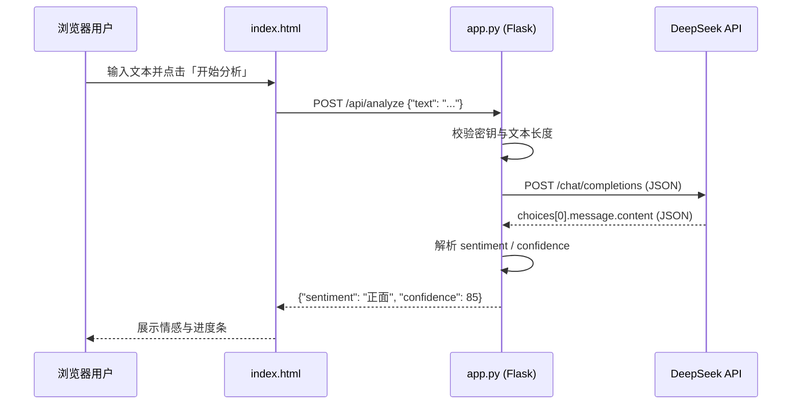

# AI 情感分析工具

基于 **Flask** 与 **DeepSeek V3** 的中文文本情感分析 Web 应用。用户在浏览器中输入任意中文文本，后端调用大模型 API 判断情感倾向（正面 / 负面 / 中性）并返回置信度，前端以深色主题界面展示结果。

---

## 目录

- [项目概述](#项目概述)
- [功能特性](#功能特性)
- [技术栈](#技术栈)
- [项目结构](#项目结构)
- [系统架构](#系统架构)
- [快速开始](#快速开始)
- [配置说明](#配置说明)
- [API 文档](#api-文档)
- [前端说明](#前端说明)
- [安全与注意事项](#安全与注意事项)
- [常见问题](#常见问题)
- [扩展建议](#扩展建议)

---

## 项目概述

本项目是一个轻量级的 **演示 / 学习用** 情感分析工具，适合作为：

- 大模型 API（OpenAI 兼容格式）接入示例
- Flask 单文件后端 + 静态前端的入门 Web 项目
- 中文 NLP 情感分析的前端原型

核心流程：用户在 `index.html` 输入文本 → 前端 `POST /api/analyze` → `app.py` 构造提示词并请求 DeepSeek → 解析 JSON 结果 → 页面展示情感与置信度。

**运行环境要求：**

- Python 3.7+
- 可访问互联网的运行环境（需调用 DeepSeek 云端 API）
- 有效的 [DeepSeek](https://platform.deepseek.com) API 密钥

---

## 功能特性

| 功能 | 说明 |
|------|------|
| 中文情感分析 | 识别文本为 **正面**、**负面** 或 **中性** |
| 置信度评分 | 返回 0–100 的整数，表示模型对判断的确信程度 |
| Web 界面 | 单页应用，深色模式，响应式布局 |
| 字数限制 | 前后端均限制单次输入最多 **5000** 字 |
| 加载与防重复提交 | 分析过程中按钮禁用并显示加载动画 |
| 快捷键 | 文本框内 **Ctrl + Enter** 触发分析 |
| 错误提示 | API 密钥未配置、网络失败、模型返回异常等均有中文提示 |

---

## 技术栈

| 层级 | 技术 | 用途 |
|------|------|------|
| 后端 | [Flask](https://flask.palletsprojects.com/) | HTTP 服务、静态页面托管、REST API |
| 后端 | `urllib`（标准库） | 无第三方 HTTP 客户端，直接请求 DeepSeek API |
| 大模型 | [DeepSeek Chat](https://api.deepseek.com)（`deepseek-chat`） | 对应 DeepSeek V3 对话模型 |
| 前端 | HTML5 + CSS3 + 原生 JavaScript | 无构建工具、无框架依赖 |
| 协议 | OpenAI Chat Completions 兼容格式 | `messages`、`response_format: json_object` 等 |

**依赖安装：**

```bash
pip install flask
```

> 项目当前未包含 `requirements.txt`，建议自行维护：`flask>=2.0`。

---

## 项目结构

```
my-ai-project/
├── app.py          # Flask 后端：路由、DeepSeek 调用、配置
├── index.html      # 前端页面：样式、交互、调用 /api/analyze
└── README.md       # 本说明文档
```

| 文件 | 行数级规模 | 职责 |
|------|------------|------|
| `app.py` | ~160 行 | API 密钥配置、情感分析逻辑、两个路由 |
| `index.html` | ~500 行 | 内联 CSS/JS，完整 UI 与 fetch 请求 |

---

## 系统架构



**路由一览：**

| 方法 | 路径 | 说明 |
|------|------|------|
| `GET` | `/` | 返回 `index.html` |
| `POST` | `/api/analyze` | 情感分析 JSON API |

---

## 快速开始

### 1. 获取 API 密钥

1. 访问 [https://platform.deepseek.com](https://platform.deepseek.com) 注册账号。
2. 创建 API Key（通常以 `sk-` 开头）。
3. 确保账户有余额或可用额度。

### 2. 配置密钥（二选一）

**方式 A：环境变量（推荐）**

```powershell
# Windows PowerShell
$env:DEEPSEEK_API_KEY = "sk-你的密钥"
```

```bash
# Linux / macOS
export DEEPSEEK_API_KEY="sk-你的密钥"
```

**方式 B：修改 `app.py`**

编辑配置区域中的 `DEEPSEEK_API_KEY` 默认值（不建议将真实密钥提交到版本库）。

### 3. 安装依赖并启动

```bash
cd "E:\我的项目\my-ai-project"
pip install flask
python app.py
```

终端会输出：

```
==================================================
  AI 情感分析工具已启动
  请在浏览器访问: http://127.0.0.1:5000
==================================================
```

在浏览器打开 **http://127.0.0.1:5000**，输入示例文本后点击「开始分析」即可。

---

## 配置说明

`app.py` 顶部配置区域：

| 变量 | 默认值 | 说明 |
|------|--------|------|
| `DEEPSEEK_API_KEY` | 环境变量 `DEEPSEEK_API_KEY`，否则为占位字符串 | Bearer 认证密钥 |
| `DEEPSEEK_API_URL` | `https://api.deepseek.com/chat/completions` | API 端点 |
| `DEEPSEEK_MODEL` | `deepseek-chat` | 模型名称 |

**模型调用参数（`call_deepseek_sentiment`）：**

- `temperature`: `0.3` — 降低随机性，输出更稳定
- `response_format`: `{"type": "json_object"}` — 强制 JSON 格式回复
- 请求超时：`60` 秒

**系统提示词要点：** 要求模型仅返回 JSON，例如 `{"sentiment": "正面", "confidence": 85}`，且 `sentiment` 只能是「正面」「负面」「中性」之一。

**启动参数（`app.run`）：**

- `host`: `127.0.0.1`（仅本机访问）
- `port`: `5000`
- `debug`: `True`（开发模式；生产环境应改为 `False`）

---

## API 文档

### `POST /api/analyze`

对一段文本进行情感分析。

**请求头：**

```
Content-Type: application/json
```

**请求体：**

```json
{
  "text": "今天天气真好，心情特别愉快！"
}
```

**成功响应（HTTP 200）：**

```json
{
  "sentiment": "正面",
  "confidence": 85
}
```

| 字段 | 类型 | 说明 |
|------|------|------|
| `sentiment` | string | `正面` \| `负面` \| `中性` |
| `confidence` | integer | 0–100 |

**错误响应：**

| HTTP 状态码 | 场景 | 示例 `error` |
|-------------|------|----------------|
| 400 | 文本为空 | `请输入要分析的文本内容` |
| 400 | 超过 5000 字 | `文本长度不能超过 5000 字` |
| 500 | 未配置 API 密钥 | `请先在 app.py 中配置...` |
| 500 | DeepSeek 或网络异常 | 具体异常信息字符串 |

**curl 示例：**

```bash
curl -X POST http://127.0.0.1:5000/api/analyze \
  -H "Content-Type: application/json" \
  -d "{\"text\": \"这个产品太差了，非常失望。\"}"
```

---

## 前端说明

### 界面设计

- **主题**：深色背景（`#0d0d0f`），卡片式布局，红色强调色（`#fe2c55`）
- **情感颜色**：正面绿色、负面红色、中性黄色
- **结果区**：双列网格展示「情感倾向」与「置信度」，下方为带动画的置信度进度条

### 主要交互逻辑

1. 实时字数统计（`0 / 5000`）
2. `startAnalysis()` 通过 `fetch` 调用 `/api/analyze`
3. 分析中禁用按钮，显示 spinner
4. 成功则 `showResult(sentiment, confidence)`；失败则 `showError(message)`
5. 若 `Failed to fetch`，提示检查后端是否已启动

### 与后端的约定

前端与后端对 `sentiment` 的中文枚举值保持一致，CSS 类名映射为：

- `正面` → `.sentiment-positive`
- `负面` → `.sentiment-negative`
- 其他 → `.sentiment-neutral`

---

## 安全与注意事项

1. **切勿将真实 API 密钥提交到 Git**  
   优先使用环境变量；若 `app.py` 中含占位或示例密钥，部署前务必替换。

2. **密钥校验不一致**  
   代码中占位符文案存在两处差异：配置默认为「输入你已经充值好的...」，而 `/api/analyze` 判断的是「在这里填入你的DeepSeek_API密钥」。使用环境变量或正确替换默认值即可正常调用。

3. **费用与限流**  
   每次分析都会消耗 DeepSeek API 额度；长文本或高频调用会产生费用，请注意平台计费规则。

4. **生产部署**  
   - 关闭 `debug=True`  
   - 使用 Gunicorn / Waitress 等 WSGI 服务器  
   - 配置 HTTPS 与反向代理（如 Nginx）  
   - 不要将服务绑定在公网且无鉴权的端口上（当前无用户认证）

5. **数据隐私**  
   用户输入的文本会发送至 DeepSeek 云端处理，敏感内容请勿用于未授权场景。

---

## 常见问题

**Q: 浏览器提示「无法连接服务器」？**  
A: 确认已执行 `python app.py`，且访问地址为 `http://127.0.0.1:5000`（与启动端口一致）。

**Q: 返回 500 并提示配置 API 密钥？**  
A: 设置 `DEEPSEEK_API_KEY` 环境变量，或在 `app.py` 中填入有效 `sk-` 密钥。

**Q: DeepSeek API 请求失败？**  
A: 检查网络、密钥是否有效、账户余额，以及 API 地址是否可访问。

**Q: 情感结果不符合预期？**  
A: 大模型输出受提示词与 `temperature` 影响，可调整 `system_prompt` 或降低/提高温度；本工具为演示性质，非专业标注数据集训练模型。

**Q: 如何修改端口？**  
A: 修改 `app.py` 末尾 `app.run(..., port=5000)`，并相应更改访问 URL。

---

## 扩展建议

若要将本项目演进为更完整的应用，可考虑：

- 添加 `requirements.txt` 与 `Dockerfile`
- 将 API 密钥校验逻辑与占位符文案统一
- 增加请求日志、速率限制与简单 API Key 鉴权
- 支持批量分析、历史记录（需数据库）
- 拆分前端为独立静态资源目录，或使用 Vue/React 重构
- 单元测试：对 `call_deepseek_sentiment` 的 JSON 解析与字段规范化做 mock 测试

---

## 许可证与归属

本项目为学习与演示用途的示例代码。使用 DeepSeek API 须遵守 [DeepSeek 平台服务条款](https://platform.deepseek.com)。Flask 遵循其各自开源许可证。
# my-ai-project

